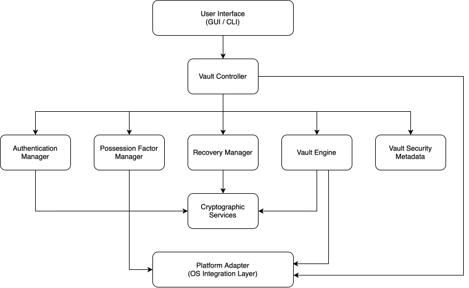
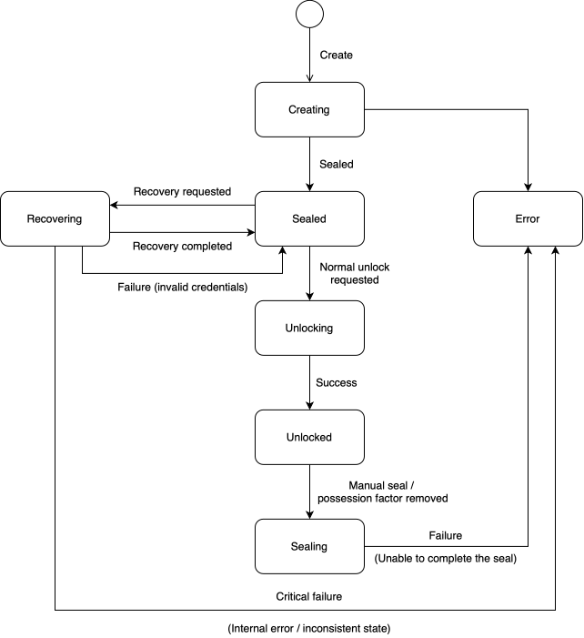
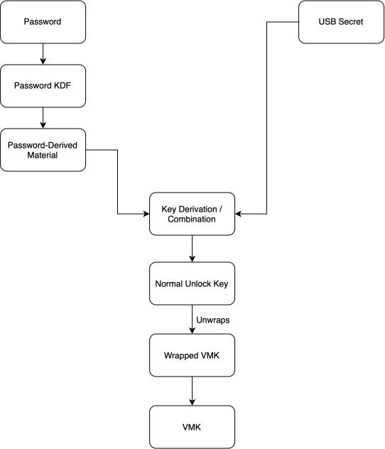
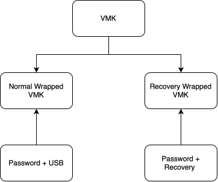
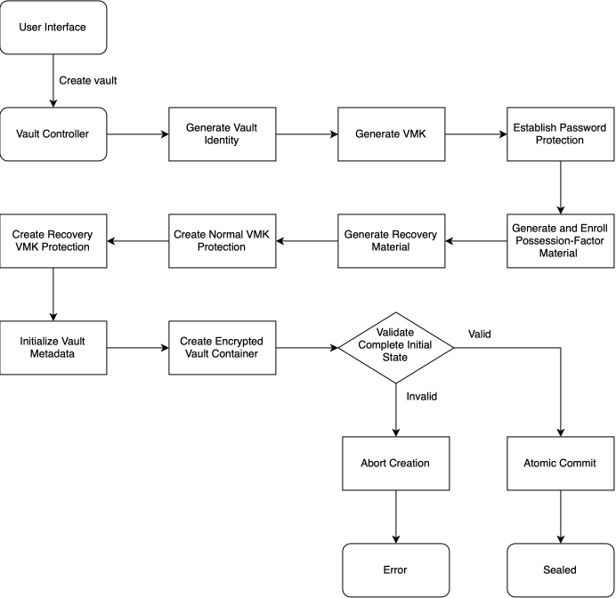
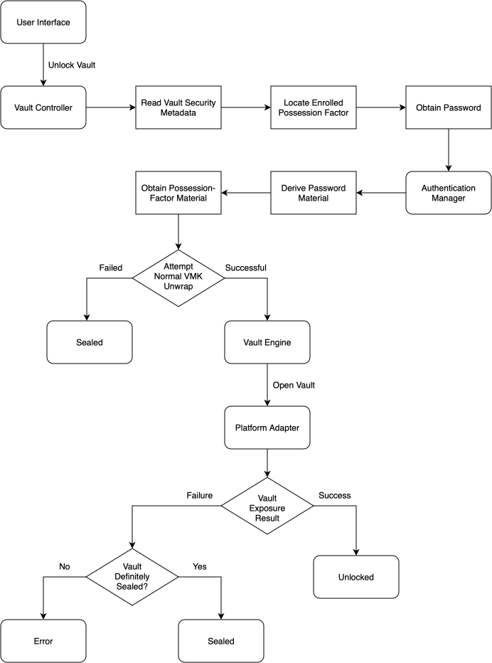
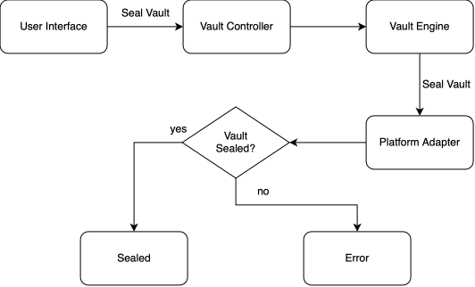
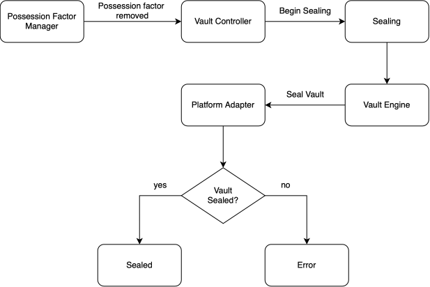
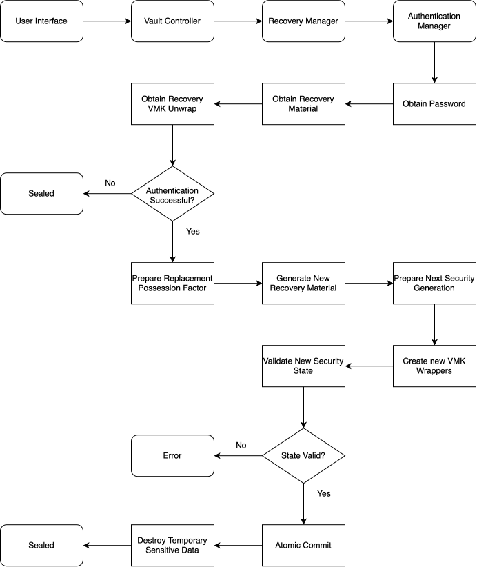

# WraithSeal Architecture

## Table of Contents

1. [Introduction](#1-introduction)
2. [Architectural Principles](#2-architectural-principles)
3. [System Components](#3-system-components)
4. [Component Responsibilities](#4-component-responsibilities)
5. [Dependency Boundaries](#5-dependency-boundaries)
6. [Vault Runtime State Machine](#6-vault-runtime-state-machine)
7. [Vault Security Metadata](#7-vault-security-metadata)
8. [Key Protection Model](#8-key-protection-model)
9. [Core Operation Flows](#9-core-operation-flows)
10. [Platform Abstraction](#10-platform-abstraction)
11. [Failure and Recovery Behaviour](#11-failure-and-recovery-behaviour)
12. [Glossary](#12-glossary)

## List of Figures

- [Figure 1. Dependency Structure](#figure-1-dependency-structure)
- [Figure 2. Vault State Machine](#figure-2-vault-state-machine)
- [Figure 3. Normal Unlock Key Flow](#figure-3-normal-unlock-key-flow)
- [Figure 4. Recovery Unlock Key Flow](#figure-4-recovery-unlock-key-flow)
- [Figure 5. Dual VMK Protection](#figure-5-dual-vmk-protection)
- [Figure 6. Vault Creation Flow](#figure-6-vault-creation-flow)
- [Figure 7. Normal Unlock Flow](#figure-7-normal-unlock-flow)
- [Figure 8. Manual Seal Flow](#figure-8-manual-seal-flow)
- [Figure 9. Automatic Seal Flow](#figure-9-automatic-seal-flow)
- [Figure 10. Recovery Flow](#figure-10-recovery-flow)

---

## 1. Introduction

This document defines the logical software architecture of the encrypted vault system.

It describes the main components, their responsibilities, their permitted dependencies, the runtime lifecycle of a vault, the persistent security state associated with a vault, and the conceptual model used to protect the key that provides access to encrypted vault data.

This document does not define concrete cryptographic algorithms, parameter values, serialized file formats, programming-language-specific interfaces, or operating-system-specific implementation details.

Those details are intentionally separated from the architectural model.

---

## 2. Architectural Principles

The architecture is guided by the following principles:

- Security-sensitive responsibilities should be separated into clearly defined components.
- The user interface must not orchestrate authentication, recovery, key handling, or vault lifecycle operations directly.
- Normal unlock and recovery must remain distinct operational paths.
- The component responsible for vault data access must not depend on passwords, USB devices, or recovery files directly.
- Standard USB devices must be treated as clonable storage devices rather than tamper-resistant security hardware.
- Security-sensitive state changes must become authoritative atomically.
- The runtime state of the vault must reflect its actual condition rather than the intended result of an operation.
- Platform-specific behaviour must be isolated behind platform abstractions.
- Cryptographic operations must rely on established cryptographic libraries rather than custom primitives.

---

## 3. System Components

The system is divided into the following logical components:

- User Interface.
- Vault Controller.
- Authentication Manager.
- Possession Factor Manager.
- Recovery Manager.
- Vault Security Metadata.
- Vault Engine.
- Cryptographic Services.
- Platform Adapter.

These components define logical responsibility boundaries. Their final implementation may use modules, classes, services, libraries, or other language-appropriate structures.

---

## 4. Component Responsibilities

### 4.1 User Interface

The User Interface provides the interaction layer between the user and the system.

It may request operations such as:

- Create a vault.
- Unlock a vault.
- Seal a vault.
- Recover a vault.
- Inspect vault state.

The User Interface must not directly coordinate authentication factors, cryptographic key derivation, possession-factor validation, recovery state transitions, or vault mounting.

All security-sensitive workflows must be delegated to the Vault Controller.

### 4.2 Vault Controller

The Vault Controller is the central orchestration component.

It coordinates the lifecycle of the vault and invokes the appropriate components in the correct order.

Its responsibilities include:

- Starting vault creation.
- Coordinating normal unlock.
- Coordinating manual sealing.
- Responding to possession-factor removal.
- Coordinating recovery.
- Inspecting and reporting vault state.
- Managing runtime state transitions.
- Ensuring that operations complete before a new authoritative state is reported.

The Vault Controller must not implement cryptographic primitives directly.

### 4.3 Authentication Manager

The Authentication Manager is responsible for validating the authentication combinations permitted by the security model.

It supports two distinct authentication paths:

- Normal authentication using the user password and valid possession-factor material.
- Recovery authentication using the user password and valid recovery material.

The Authentication Manager must not expose a generic mechanism that allows arbitrary combinations of authentication factors.

| **Case**                              | **Result**              |
| ------------------------------------- | ----------------------- |
| Password + Possession Factor          | Normal Authentication   |
| Password + Recovery Material          | Recovery Authentication |
| Possession Factor + Recovery Material | Invalid                 |
| Password alone                        | Invalid                 |

The Authentication Manager may derive or request derivation of key-protection material required to unwrap protected vault key material.

It must not discover USB devices, mount vault contents, or expose decrypted user data.

### 4.4 Possession Factor Manager

The Possession Factor Manager owns the interaction with removable USB possession factors.

Its responsibilities include:

- Discovering removable devices.
- Enrolling a possession factor.
- Reading possession-factor material.
- Validating possession-factor binding.
- Replacing an enrolled possession factor.
- Monitoring presence of the enrolled possession factor while the vault is unlocked.
- Reporting possession-factor removal to the Vault Controller.

The possession factor must contain cryptographically strong random material generated for the vault.

USB serial numbers, filesystem identifiers, vendor identifiers, product identifiers, and similar device metadata must not be treated as secret cryptographic material.

Such identifiers may be used as additional validation or usability inputs where appropriate.

The Possession Factor Manager must not directly seal or unlock the vault.

### 4.5 Recovery Manager

The Recovery Manager coordinates exceptional recovery operations.

Its responsibilities include:

- Initiating recovery authentication through the Authentication Manager.
- Preparing a replacement possession factor.
- Preparing new recovery material.
- Preparing the next security generation.
- Validating the replacement security configuration.
- Committing the new security state atomically.
- Ensuring that previous possession and recovery material are invalidated for the new current vault state.

Recovery does not directly unlock the vault for normal user access.

A successful recovery restores a valid authentication configuration and returns the vault to the sealed state.

### 4.6 Vault Security Metadata

Vault Security Metadata represents the persistent security-critical state associated with a vault.

It contains information such as:

- Vault identity.
- Vault format version.
- Security generation.
- Authentication configuration.
- Possession-factor metadata.
- Recovery metadata.
- Integrity or authentication metadata.

This architectural model does not require all metadata to be stored in a single serialized structure.

The concrete persistent representation is defined separately from the architecture.

### 4.7 Vault Engine

The Vault Engine manages the encrypted vault container and access to its protected contents.

Its responsibilities include:

- Creating the encrypted container.
- Opening the encrypted container using authorized key material.
- Verifying protected container data.
- Exposing decrypted vault contents through the operating system.
- Sealing the vault.
- Returning the vault to a state in which protected contents are no longer accessible.

The Vault Engine must not depend directly on:

- User passwords.
- USB devices.
- Recovery files.
- Possession-factor discovery.
- Recovery workflows.

It receives only the cryptographic material required to perform vault operations.

### 4.8 Cryptographic Services

Cryptographic Services provide a narrow internal abstraction over established cryptographic libraries.

They may provide operations such as:

- Cryptographically secure random generation.
- Password-based key derivation.
- Key derivation.
- Authenticated encryption.
- Key wrapping and unwrapping.
- Secure comparison.
- Integrity verification.
- Secure handling of sensitive key material where supported.

Cryptographic Services must not contain vault business logic.

### 4.9 Platform Adapter

The Platform Adapter isolates operating-system-specific behaviour.

Its responsibilities may include:

- Filesystem interaction.
- Vault exposure or mounting.
- Removable-device enumeration.
- Device insertion and removal events.
- Secure random source integration.
- Secure-memory support where available.
- Operating-system-specific storage and process integration.

The rest of the application should depend on platform abstractions rather than directly embedding platform-specific logic.

---

## 5. Dependency Boundaries

<div align="center">



##### Figure 1. Dependency Structure

</div>

The following direct dependencies should be avoided:

```text
User Interface -> Authentication Manager
User Interface -> Vault Engine
Possession Factor Manager -> Vault Engine
Vault Engine -> Recovery Manager
Vault Engine -> Possession Factor Manager
```

These boundaries ensure that security-sensitive workflows remain coordinated through the Vault Controller.

---

## 6. Vault Runtime State Machine

The vault uses an explicit runtime state machine.

The principal runtime states are:

- `CREATING`.
- `SEALED`.
- `UNLOCKING`.
- `UNLOCKED`.
- `SEALING`.
- `RECOVERING`.
- `ERROR`.

<div align="center">



##### Figure 2. Vault State Machine

</div>

### 6.1 Creating

A vault enters `CREATING` while its initial security configuration and encrypted container are being prepared.

The vault must not become a valid usable vault until initialization completes successfully.

If creation fails before the final authoritative state is committed, the incomplete result must not be treated as a valid vault.

### 6.2 Unlocking

A sealed vault enters `UNLOCKING` during normal authentication.

If authentication succeeds and the vault is successfully opened, the state becomes `UNLOCKED`.

If the supplied authentication factors are invalid, the state returns to `SEALED`.

Invalid authentication is not itself a vault error.

### 6.3 Unlocked

`UNLOCKED` means that decrypted vault contents may be accessible through the operating system.

The state remains active until sealing is requested.

Sealing may be requested by:

- The user.
- Removal of the enrolled possession factor.
- Another security-relevant event requiring the vault to close.

### 6.4 Sealing

The vault enters `SEALING` while access to decrypted contents is being removed.

A successful sealing operation transitions to `SEALED`.

A failed sealing operation must not transition to `SEALED`.

Instead, the system enters `ERROR` and must expose that the vault may still be accessible.

### 6.5 Recovering

Recovery begins only from the sealed state.

Recovery requires:

- The correct user password.
- Valid recovery material.

Recovery is used to restore the normal authentication configuration after loss or unavailability of the possession factor.

A successful recovery must:

- Prepare replacement possession-factor material.
- Prepare new recovery material.
- Prepare the next security generation.
- Commit the new security state.
- Invalidate previous possession and recovery material for the current vault state.
- Return to `SEALED`.

Recovery must not transition directly to `UNLOCKED`.

### 6.6 Error

`ERROR` represents an operation or vault condition that prevents the runtime state from being safely represented as one of the normal states.

Possible causes include:

- Integrity validation failure.
- I/O failure.
- Partial security-sensitive operation.
- Failed sealing.
- Corrupted metadata.
- Unsupported persistent state.
- Unexpected platform failure.

`ERROR` must not imply that the vault is sealed.

The system must determine the actual vault condition before transitioning out of `ERROR`.

---

## 7. Vault Security Metadata

Each vault has persistent security metadata that is independent from the application version.

The following concepts must remain distinct:

```text
Software version
Vault format version
Security generation
Vault runtime state
```

For example:

```text
Software version:      2.0.0
Vault format version:  1
Security generation:   5
Vault runtime state:   SEALED
```

Updating the application does not inherently change the security generation.

A vault format migration does not inherently invalidate possession or recovery material.

The security generation changes when the authoritative security configuration of the vault changes in a way that invalidates previous security material.

For example:

```text
Generation N

Password
USB factor A
Recovery material A

        |
        | successful recovery
        v

Generation N+1

Password
USB factor B
Recovery material B
```

Possession and recovery material from generation `N` must not satisfy authentication or recovery requirements against the current vault state at generation `N+1`.

Historical copies of the vault remain historical states and cannot be retroactively modified by later rotation.

---

## 8. Key Protection Model

### 8.1 Vault Master Key

The encrypted vault is protected by a randomly generated secret called the Vault Master Key (`VMK`).

The VMK is independent from:

- The user password.
- The USB possession factor.
- The recovery material.

```text
CSPRNG -> VMK -> Encrypted Vault
```

The VMK is the key material required to access protected vault data.

Credential changes should normally change how the VMK is protected rather than require re-encryption of all vault data.

### 8.2 Normal Unlock Path

Normal vault access requires both:

- Password-derived material.
- Possession-factor material.

<div align="center">



##### Figure 3. Normal Unlock Key Flow

</div>

The exact key-derivation construction is not defined by this document.

The required architectural property is:

| Factors        | Result             |
| -------------- | ------------------ |
| Password only  | Cannot recover VMK |
| USB only       | Cannot recover VMK |
| Password + USB | Can recover VMK    |

### 8.3 Recovery Path

The recovery path protects access to the same VMK using a separate key-protection path.

<div align="center">


##### Figure 4. Recovery Unlock Key Flow

</div>

The required architectural property is:

| Factors             | Result                                  |
| ------------------- | --------------------------------------- |
| Password only       | Cannot recover VMK                      |
| Recovery only       | Cannot recover VMK                      |
| Password + recovery | Can recover VMK for recovery processing |

The VMK obtained through the recovery path must not be passed directly to the Vault Engine for normal data access.

It is used only to establish a new valid security configuration.

### 8.4 Dual VMK Protection

The same VMK is protected through two independent credential paths:

<div align="center">



##### Figure 5. Dual VMK Protection

</div>

This allows possession-factor replacement, recovery-material rotation, and password changes without requiring the encrypted vault contents to be fully re-encrypted.

### 8.5 Possession-Factor Secret

The possession factor contains cryptographically strong random material generated specifically for the vault.

```text
CSPRNG -> Possession Secret -> Enrolled USB Device
```

The possession secret is not derived from device identifiers.

Because standard USB storage is clonable, copying the possession secret is treated as compromise of the possession factor.

The password must remain independently necessary.

### 8.6 Recovery Secret

Recovery material contains a high-entropy random secret associated with the vault.

```text
CSPRNG -> Recovery Secret -> Recovery File
```

The recovery file may also contain non-secret metadata required to identify its format or intended vault.

The recovery file must not contain the VMK in directly usable form.

### 8.7 Password-Derived Material

Unlike the USB and recovery secrets, a human password cannot be assumed to have high entropy.

The password therefore passes through a password-based key derivation function before it contributes to key protection.

```text
Password -> Password KDF -> Password-derived material
```

The concrete password KDF and its parameters are defined separately.

The design must assume that an attacker may obtain sufficient stored material to perform offline password guessing.

### 8.8 Password Change

Changing the password should not require re-encrypting the complete vault.

```text
Old configuration:
Password P1 + USB -> Normal Wrapped VMK
Password P1 + Recovery -> Recovery Wrapped VMK

New configuration:
Password P2 + USB -> New Normal Wrapped VMK
Password P2 + Recovery -> New Recovery Wrapped VMK
```

The VMK remains unchanged.

The operation must become authoritative atomically.

### 8.9 Possession-Factor Replacement

Replacing a possession factor changes the normal key-protection path without changing the VMK.

```text
Old:
Password + USB A -> Wrapped VMK

New:
Password + USB B -> New Wrapped VMK
```

After the new state is committed, possession material associated with the previous current generation must no longer satisfy normal authentication against the current vault state.

### 8.10 Recovery Rotation

Recovery rotation replaces the recovery key-protection path without changing the VMK.

```text
Old:
Password + Recovery A -> Recovery Wrapped VMK

New:
Password + Recovery B -> New Recovery Wrapped VMK
```

After the new state is committed, previous recovery material must no longer satisfy recovery requirements against the current vault state.

---

## 9. Core Operation Flows

### 9.1 Vault Creation

<div align="center">



##### Figure 6. Vault Creation Flow

</div>

If creation fails before commit, the partial state must not become authoritative.

### 9.2 Normal Unlock

<div align="center">



##### Figure 7. Normal Unlock Flow

</div>

If normal authentication fails, the vault remains sealed.

### 9.3 Manual Seal

<div align="center">



##### Figure 8. Manual Seal Flow

</div>

A failed sealing operation must never be reported as successfully sealed.

### 9.4 Automatic Seal on Possession-Factor Removal

<div align="center">



##### Figure 9. Automatic Seal Flow

</div>

The Possession Factor Manager does not seal the vault directly.

### 9.5 Recovery

<div align="center">



##### Figure 10. Recovery Flow

</div>

Recovery does not expose decrypted vault contents.

---

## 10. Platform Abstraction

Platform-specific functionality is isolated behind the Platform Adapter. This
allows the core architecture to remain independent from the operating system
and prevents platform-specific logic from being distributed across
security-sensitive components.

The Platform Adapter provides the abstractions required by the rest of the
system for operations such as:

- Filesystem interaction.
- Vault exposure and mounting.
- Removable-device discovery and access.
- Device insertion and removal events.
- Cryptographically secure randomness provided by the operating system.
- Secure-memory facilities where available.
- Other operating-system-specific integration required by the vault lifecycle.

Components such as the Vault Engine and Possession Factor Manager interact with
these capabilities through the Platform Adapter rather than implementing
operating-system-specific behaviour directly.

The concrete implementation of these operations may differ significantly
between Windows, Linux, and macOS. Each platform may expose different APIs,
filesystem capabilities, device-management mechanisms, and security features.
These differences must remain contained within the platform-specific
implementation and must not alter the security guarantees expected by the rest
of the system.

A platform must only be considered supported when the required vault lifecycle
and security behaviour can be implemented reliably. In particular, platform
support must not weaken authentication requirements, possession-factor
monitoring, sealing behaviour, integrity guarantees, or the handling of
sensitive material.

---

## 11. Failure and Recovery Behaviour

Security-sensitive operations must be designed so that an interruption or
failure cannot silently make a partially updated security configuration
authoritative. Until a new state has been completely prepared, validated, and
committed, the previous valid state remains authoritative.

This requirement applies in particular to:

- Vault creation.
- Recovery.
- Possession-factor replacement.
- Recovery-material rotation.
- Password changes.
- Security metadata updates.

For operations that modify persistent security state, the new state must first
be prepared without replacing the current authoritative state. The complete
result must then be validated before it can be committed. Only after a
successful commit may the new security state be considered authoritative.

If an operation fails before the commit is completed, the system must preserve
the previous authoritative state whenever this can be done safely. Temporary
or incomplete security material produced during the failed operation must not
be treated as valid current material.

Failures must also be reported according to the actual condition of the vault.
The system must not report the intended result of an operation when that result
has not been confirmed.

Sealing requires special handling because the vault may already expose
decrypted contents when the operation begins. If sealing fails, the system
cannot assume that those contents are no longer accessible. A failed sealing
operation therefore transitions the vault to `ERROR` rather than `SEALED`.

The `ERROR` state must preserve the fact that the actual security condition may
require further verification or corrective action. It must never be used to
hide an uncertain or partially completed operation behind an apparently safe
state.

Consequently, the system must never report `SEALED` unless it has confirmed
that sealing completed successfully and decrypted vault contents are no longer
exposed.

---

## 12. Glossary

| Term                        | Definition                                                                                                                                                                                           |
| --------------------------- | ---------------------------------------------------------------------------------------------------------------------------------------------------------------------------------------------------- |
| **Vault Master Key (VMK)**  | Random high-entropy key material that ultimately provides cryptographic access to the encrypted vault contents.                                                                                      |
| **CSPRNG**                  | Cryptographically Secure Pseudorandom Number Generator. A secure random generator used to create secrets such as the VMK, possession secret, and recovery secret.                                    |
| **Password KDF**            | Password-based Key Derivation Function. A deliberately expensive transformation that converts a human password into cryptographic key material suitable for use in authentication or key protection. |
| **Wrapped VMK**             | A protected representation of the VMK that can only be recovered using the appropriate key-protection material.                                                                                      |
| **Normal Unlock Key**       | Conceptual key-protection material derived from the password and possession factor for normal access.                                                                                                |
| **Recovery Unlock Key**     | Conceptual key-protection material derived from the password and recovery material for recovery processing.                                                                                          |
| **Possession Factor**       | An enrolled removable USB device that provides the possession component required for normal vault authentication.                                                                                    |
| **Possession Secret**       | High-entropy random material associated with an enrolled possession factor.                                                                                                                          |
| **Recovery Material**       | Recovery information associated with a vault and used together with the user password to authorize recovery.                                                                                         |
| **Recovery Secret**         | High-entropy random secret contained within the recovery material and used during recovery authentication.                                                                                           |
| **Vault Security Metadata** | Persistent security-critical information associated with a vault, including its identity, security generation, authentication configuration, and related security metadata.                          |
| **Security Generation**     | Version of the current security configuration of a vault. It changes when security material is replaced or invalidated.                                                                              |
| **Vault Format Version**    | Version of the persistent vault data format. It is independent from the software version and security generation.                                                                                    |
| **Runtime State**           | Current operational state of the vault, such as `SEALED`, `UNLOCKED`, or `RECOVERING`.                                                                                                               |
| **Authoritative State**     | The security configuration currently recognized by the system as valid and active for a vault.                                                                                                       |
| **Atomic Commit**           | Transition in which a complete new security state becomes authoritative as one logical operation rather than through partially visible intermediate states.                                          |
| **Platform Adapter**        | Abstraction layer that isolates operating-system-specific functionality from the core vault architecture.                                                                                            |
