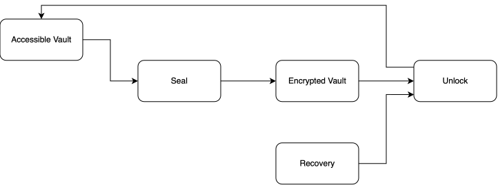
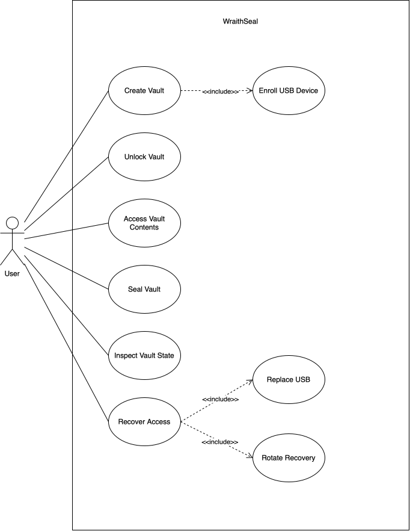

# WraithSeal Project Specification

## Table of Contents

1. [Introduction](#1-introduction)
2. [Project Scope](#2-project-scope)
3. [Goals](#3-goals)
4. [Non-Goals](#4-non-goals)
5. [System Overview](#5-system-overview)
6. [Core Use Cases](#6-core-use-cases)
7. [Vault Model](#7-vault-model)
8. [Authentication Model](#8-authentication-model)
9. [Unlock and Seal Behaviour](#9-unlock-and-seal-behaviour)
10. [Recovery Requirements](#10-recovery-requirements)
11. [Security Requirements](#11-security-requirements)
12. [Functional Requirements](#12-functional-requirements)
13. [Non-Functional Requirements](#13-non-functional-requirements)
14. [Platform Requirements](#14-platform-requirements)
15. [Glossary](#15-glossary)

## List of Figures

- [Figure 1. System Flow](#figure-1-system-flow)
- [Figure 2. Use Case](#figure-2-use-case)

---

## 1. Introduction

WraithSeal is an open-source security project for hardware-assisted encrypted storage.

The system is designed around a two-factor access model combining:

- Something the user **knows**, represented by a password.
- Something the user **possesses**, represented by an enrolled removable USB device.

Protected data is stored inside an encrypted vault container. Access to the vault is granted only when the required authentication factors are available.

The project aims to provide a simple, auditable, and security-focused approach to encrypted storage while relying on established cryptographic primitives.

---

## 2. Project Scope

The system provides encrypted storage through a dedicated vault container.

The vault behaves as a protected storage space that can be unlocked by the user, accessed through the operating system, and sealed again when access is no longer required.

Normal access requires both:

- The user's password.
- An enrolled USB possession factor.

A controlled recovery mechanism provides access when the enrolled USB device is lost, damaged, or otherwise unavailable.

---

## 3. Goals

The primary goals of the project are:

- Protect user data inside an encrypted vault container.
- Require two independent factors for normal vault access.
- Use a removable USB device as a physical possession factor.
- Use password-based protection as the knowledge factor.
- Automatically react to removal of the enrolled USB device.
- Provide a secure recovery mechanism.
- Support replacement of a lost or damaged possession factor.
- Use established cryptographic primitives and maintained libraries.
- Maintain a design that is understandable and auditable.
- Support multiple operating systems where practical.

---

## 4. Non-Goals

The project is not intended to:

- Replace full-disk encryption solutions such as BitLocker or FileVault.
- Provide protection against a fully compromised operating system while the vault is unlocked.
- Implement proprietary or custom cryptographic algorithms.
- Treat a standard USB storage device as tamper-resistant hardware.
- Guarantee protection against every form of physical or hardware attack.

---

## 5. System Overview

##### Figure 1. System Flow

The system protects user data by storing it inside an encrypted vault container.

Under normal operation, access to the vault requires successful authentication using both the user's password and an enrolled removable USB device. Neither factor is sufficient on its own.

Once authentication succeeds, the vault becomes accessible through the operating system. The user can interact with its contents until the vault is sealed.

The vault may be sealed explicitly by the user or automatically following removal of the enrolled USB device.

If the enrolled device is lost, damaged, or otherwise unavailable, access may be recovered using the user's password together with the recovery file associated with the vault. Successful recovery allows the normal access configuration to be restored by enrolling a replacement USB device and replacing the previous recovery material.

---

## 6. Core Use Cases

##### Figure 2. Use Case

### 6.1 Create a Vault

The user creates a new encrypted vault.

During initialization, the system must prepare the vault and the material required for authentication and recovery.

The user must enroll at least one USB possession factor before normal access to the vault is possible.

### 6.2 Unlock a Vault

The user provides:

- The correct password.
- The enrolled USB possession factor.

If both factors are valid, the protected vault contents are made available.

If either factor is missing or invalid, access must be denied.

### 6.3 Access Vault Contents

Once unlocked, the user must be able to interact with the vault contents through the operating system as normal stored data.

Access to decrypted contents must only remain available while the vault is unlocked.

### 6.4 Seal a Vault

The user may explicitly seal an unlocked vault.

After sealing:

- The decrypted vault contents must no longer be accessible.
- Sensitive key material associated with the unlocked state must no longer remain available beyond what is strictly necessary for system operation.
- The system must accurately report the resulting vault state.

### 6.5 Automatic Seal on USB Removal

If the enrolled USB possession factor is removed while the vault is unlocked, the system must detect the removal and initiate the secure sealing process.

The system must handle conditions that prevent the vault from being immediately sealed without silently leaving it in an assumed secure state.

The user must be informed when the vault cannot be securely sealed.

### 6.6 Recover Access

If the enrolled USB possession factor is unavailable, the user may initiate recovery using:

- The correct password.
- The corresponding recovery file.

Both factors must be valid for recovery to succeed.

Successful recovery must allow the user to regain control of the vault and enroll a replacement possession factor.

### 6.7 Replace a Possession Factor

Following successful recovery, the user must be able to enroll a new USB device.

Material associated with the previous possession factor must be invalidated so that the previous device can no longer satisfy the possession requirement for the vault.

### 6.8 Rotate Recovery Material

After successful recovery, new recovery material must be generated.

Previously issued recovery material must be invalidated and must no longer provide recovery access to the vault.

---

## 7. Vault Model

The system uses an encrypted container model.

Protected data is stored inside a dedicated encrypted container rather than being managed as individually encrypted files or through full-disk encryption.

While sealed, the contents of the container must remain inaccessible without successful authentication.

While unlocked, the contents must be available through the operating system as normal stored data.

Sealing the vault must return it to a state in which its protected contents are no longer accessible.

---

## 8. Authentication Model

Normal vault access requires two independent factors:

1. A knowledge factor represented by the user's password.
2. A possession factor represented by an enrolled removable USB device.

Possession of only one factor must not be sufficient for normal vault access.

Knowledge of the password without the enrolled possession factor must not provide normal access.

Possession of the enrolled USB device without the correct password must not provide normal access.

A standard USB storage device is not considered tamper-resistant hardware. Its role is limited to acting as a removable possession factor and providing material required by the authentication process.

Device identifiers may be used as additional validation inputs but must not be treated as secret cryptographic material.

---

## 9. Unlock and Seal Behaviour

### 9.1 Unlock

A successful unlock requires validation of both the user's knowledge factor and possession factor.

If validation succeeds, the vault is made accessible.

If either factor is missing or invalid, access must be denied without exposing protected vault contents.

### 9.2 Manual Seal

The user must be able to explicitly request that an unlocked vault be sealed.

A successful seal must make the protected contents inaccessible and transition the vault to a sealed state.

The system must not report the vault as sealed unless the sealing operation has successfully completed.

### 9.3 Automatic Seal

Removal of the enrolled possession factor while the vault is unlocked must trigger an automatic sealing attempt.

Failure to complete the sealing operation must not be silently treated as success.

The system must expose the actual vault state to the user when automatic sealing cannot be completed.

---

## 10. Recovery Requirements

Recovery exists to handle loss, failure, or unavailability of the enrolled USB possession factor.

Recovery requires:

- The user's password.
- A valid recovery file associated with the vault.

Neither factor alone must be sufficient to complete recovery.

The recovery file must contain cryptographically strong recovery material and must not contain the vault master key in directly usable form.

The recovery file must be suitable for offline storage independently from both the vault and the enrolled USB possession factor.

Successful recovery must allow the user to restore the normal two-factor access model.

After successful recovery:

- The user must be able to enroll a replacement USB possession factor.
- Material associated with the previous possession factor must be invalidated.
- New recovery material must be generated.
- Previous recovery material must be invalidated.

Recovery is an exceptional lifecycle operation and must not function as an alternative method for routine vault access.

---

## 11. Security Requirements

The system must:

- Use established cryptographic primitives.
- Use established and maintained cryptographic libraries.
- Avoid custom cryptographic algorithms.
- Generate cryptographic secrets using a cryptographically secure random number generator.
- Treat password-derived, possession-factor-derived, and recovery material as sensitive.
- Minimize the lifetime and exposure of plaintext secret material.
- Protect both the confidentiality and integrity of vault contents.
- Detect authentication or integrity failures and fail securely.
- Prevent either normal authentication factor from independently granting access.
- Ensure that invalidated possession and recovery material can no longer grant access.
- Avoid exposing sensitive information through logs, diagnostics, or error messages.

---

## 12. Functional Requirements

The system must support:

- Vault creation.
- USB possession-factor enrollment.
- Vault unlocking.
- Manual vault sealing.
- Detection of possession-factor removal.
- Automatic sealing following possession-factor removal.
- Recovery using the password and recovery file.
- Replacement of an enrolled possession factor.
- Recovery-material rotation.
- Vault state inspection.

---

## 13. Non-Functional Requirements

The implementation should provide:

- Clear and auditable code.
- Minimal unnecessary complexity.
- Secure failure behaviour.
- Maintainable architecture.
- Automated testability.
- Explicit versioning of persistent data.
- Portability across supported operating systems.
- Predictable behaviour across supported environments.
- Clear reporting of security-relevant state and failures.
- Minimal exposure of sensitive information during normal operation.

---

## 14. Platform Requirements

The system is intended to support multiple desktop operating systems where practical.

Platform support must preserve the security properties required by this specification.

A platform must not be considered supported if limitations of that platform prevent the required authentication, vault access, sealing, or security behaviour from being reliably provided.

---

## 15. Glossary

| Term                  | Definition                                                                                                                                                     |
| --------------------- | -------------------------------------------------------------------------------------------------------------------------------------------------------------- |
| **Vault**             | An encrypted container containing protected user data.                                                                                                         |
| **Possession Factor** | An enrolled removable USB device required during the normal vault unlock process. The device provides material required as part of the authentication process. |
| **Knowledge Factor**  | The user's password, required as part of the vault authentication process.                                                                                     |
| **Recovery File**     | A file containing high-entropy recovery material used together with the user's password when the enrolled possession factor is unavailable.                    |
| **Recovery Material** | Cryptographic material contained in or associated with the recovery file and used as part of the recovery process.                                             |
| **Seal**              | The process of making the contents of an unlocked vault inaccessible and ending access to its decrypted contents.                                              |
| **Unlock**            | The process of authenticating the required factors and making the vault contents available to the user.                                                        |
| **Enrollment**        | The process of registering and provisioning a removable USB device for use as a possession factor.                                                             |
